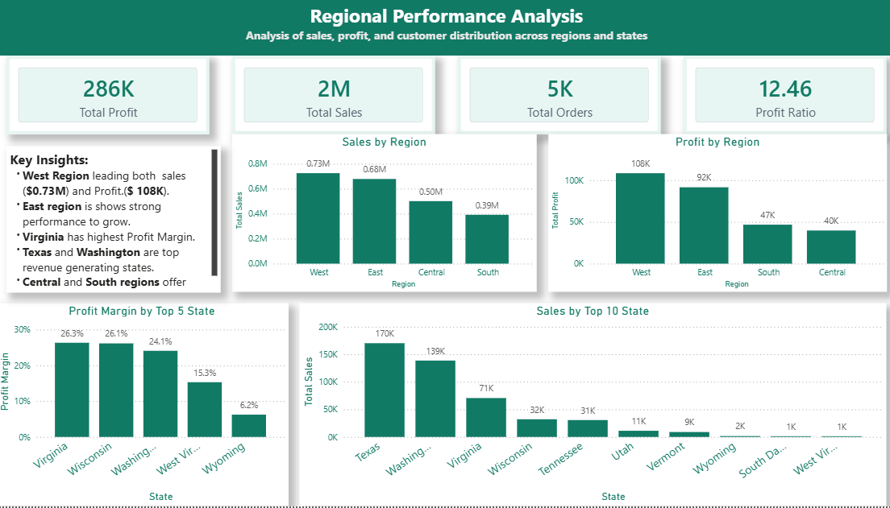
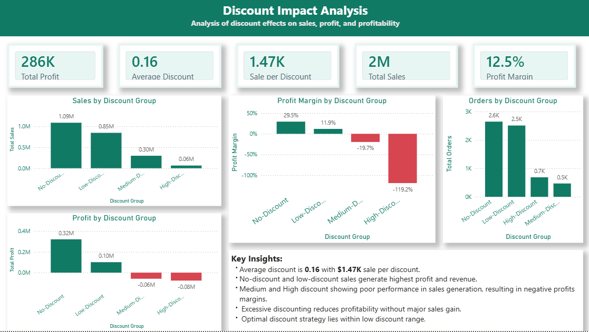

# Superstore Sales & Profit Performance Dashboard (Power BI)
### Project Overview

This project analyzes retail sales data using Power BI to uncover insights into sales performance, customer behavior, regional trends, and discount impact on profitability.

### Key Insights

* Analyzed $2M total sales and $286K profit with 12.5% profit margin

* Identified Consumer segment as highest revenue and profit contributor

* Found West region as top-performing geographic region

* Discovered high discounts negatively impact profitability

* Built interactive dashboards for business decision-making

### Dashboard Features

* Executive Overview

* Product Performance Analysis

* Customer Analysis

* Regional Analysis

* Discount Impact Analysis

### Tools Used: 

* Power BI

* DAX

* Data Modeling

* Data Visualization

## Dashboard Screenshots
### Executive Overview

### Product Analysis

### Customer Analysis

### Regional Analysis

### Discount Impact Analysis

