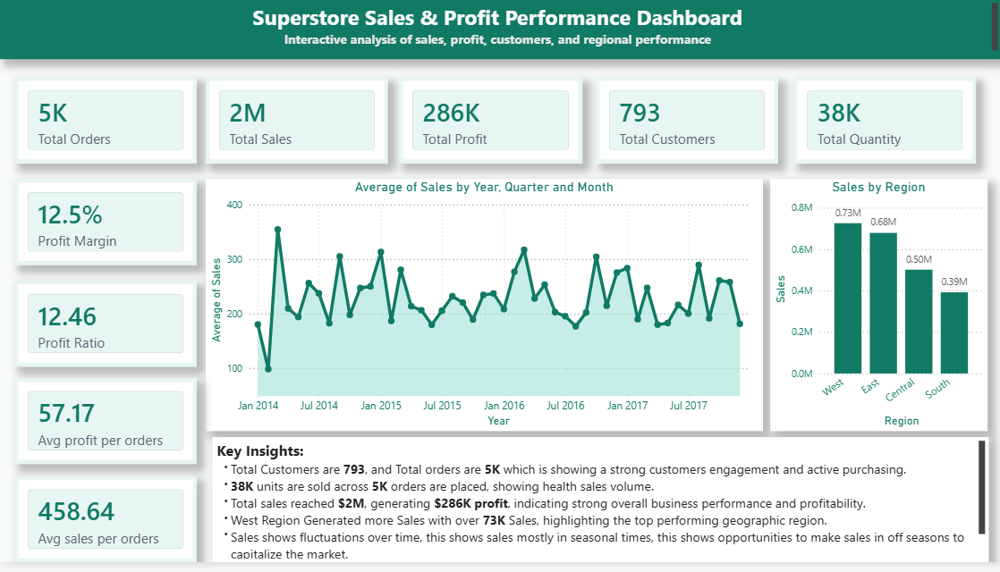
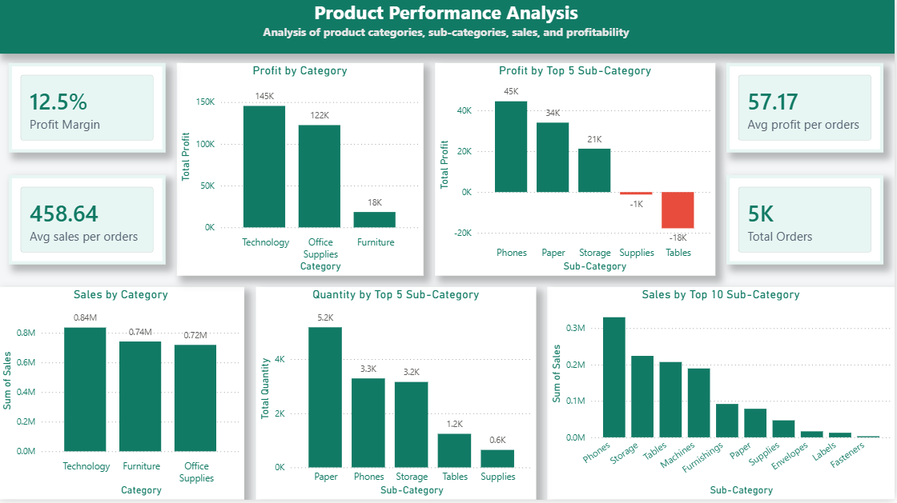
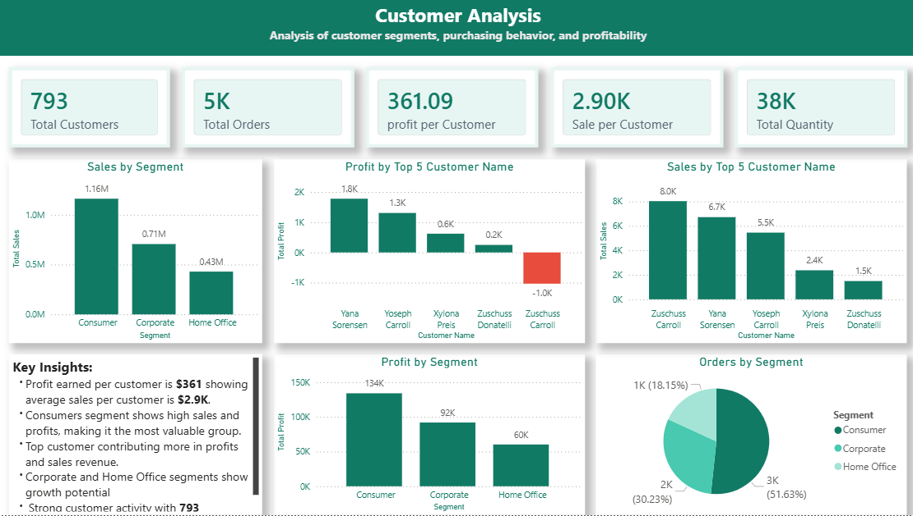

# Superstore Sales & Profit Performance Dashboard (Power BI)

## Project Overview

This project presents a comprehensive SuperStore Sales and Profit Performance Dashboard built using Power BI. The dashboard provides detailed insights into sales trends, product performance, customer behavior, regional performance, and the impact of discount strategies on profitability.

The objective of this dashboard is to help business stakeholders identify growth opportunities, improve profitability, and make data-driven decisions.

---

## Dataset Description

The dataset contains retail transaction data including:

- Orders and sales transactions
- Product categories and sub-categories
- Customer segments and purchasing behavior
- Regional and state-wise sales performance
- Discount levels and their impact on profit
- Revenue, profit, quantity, and order metrics

Key dataset metrics:

- Total Sales: $2M
- Total Profit: $286K
- Total Orders: 5K
- Total Customers: 793
- Total Quantity Sold: 38K
- Profit Margin: 12.5%

---

## Tools and Technologies Used

- Power BI
- Power Query (Data Cleaning & Transformation)
- DAX (Data Analysis Expressions)
- Data Modeling
- Business Intelligence and Data Visualization

---

## Dashboard Sections and Insights

### 1. Executive Overview

Provides a high-level summary of business performance including:

- Total Sales, Profit, Orders, and Customers
- Profit Margin and Profit Ratio
- Sales trend over time
- Sales distribution across regions

Key Insights:

- Total sales reached $2M with $286K profit
- West region generated highest sales ($0.73M)
- Sales show seasonal fluctuations indicating business cycles

---

### 2. Product Performance Analysis

Analyzes performance across product categories and sub-categories.

Insights include:

- Profit by Category
- Profit by Sub-category
- Sales by Category
- Quantity sold by Sub-category

Key Insights:

- Technology category generates highest profit ($145K)
- Phones and Paper are top-performing sub-categories
- Tables show negative profit, indicating loss-making products

---

### 3. Customer Analysis

Provides insights into customer segments and behavior.

Insights include:

- Sales and profit by customer segment
- Top customers by profit and sales
- Orders distribution across segments

Key Insights:

- Consumer segment contributes highest sales and profit
- Average sales per customer: $2.9K
- Average profit per customer: $361

---

### 4. Regional Performance Analysis

Analyzes sales and profit across different regions and states.

Insights include:

- Sales and profit by region
- Profit margin by state
- Top-performing states by sales

Key Insights:

- West region leads in both sales ($0.73M) and profit ($108K)
- Texas and Washington are top revenue-generating states
- Virginia has highest profit margin

---

### 5. Discount Impact Analysis

Analyzes how discounts affect sales and profitability.

Insights include:

- Sales by discount group
- Profit margin by discount level
- Profit impact of discounting

Key Insights:

- High discount levels result in negative profit margins (-119%)
- No-discount and low-discount sales generate highest profit
- Excessive discounting reduces overall profitability

---

## Business Value

This dashboard helps businesses:

- Monitor overall business performance
- Identify high-performing products and customers
- Detect loss-making products
- Optimize discount strategies
- Improve profitability and revenue growth
- Support strategic decision-making

---

## Dashboard Features

- Interactive filters and slicers
- Multi-page dashboard navigation
- KPI cards for key business metrics
- Trend and comparison analysis
- Regional and product-level insights

---

## Files Included

- superstore_sales_dashboard.pbix 
- Dataset file 
- Dashboard screenshots
- README.md

---

## Dashboard Preview

### Executive Overview

### Product Performance Analysis

### Customer Analysis

### Regional Performance Analysis

### Discount Impact Analysis

---

## Key Business Insights Summary

Major profit drivers:

- Technology category
- Consumer segment customers
- West region performance
- Low discount sales

Major profit risks:

- High discount strategies
- Loss-making product sub-categories like Tables

---

## Author

Ram  
Power BI Developer | Data Analyst  
